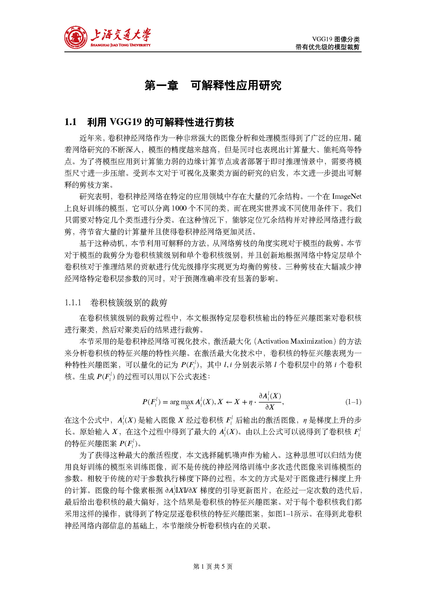
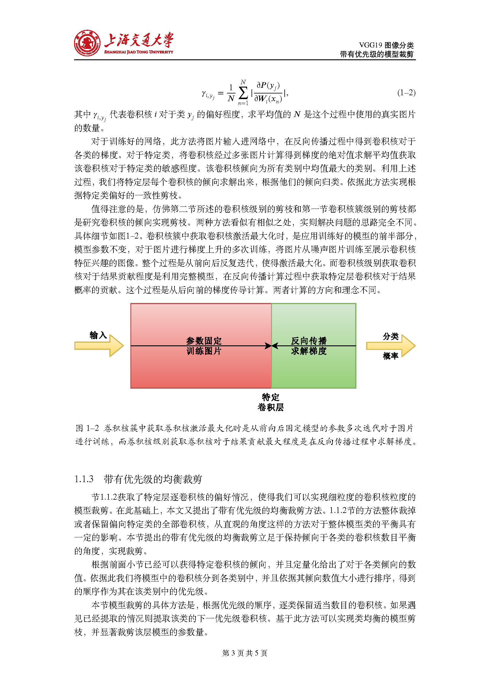
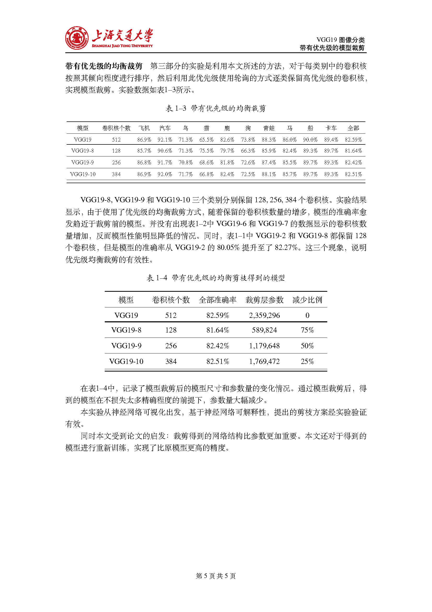

# Model-Pruning-in-Deep-Learning

  Final Project of Algorithm

---

### 代码逻辑

本目录下：

- `train_vgg19.py` 从预训练模型继续训练
- `prune_demo.py` 直接使用 torch 库进行裁剪

`codes` 文件夹是自己剪枝方法的实现

本文[使用的模型](https://drive.google.com/file/d/1R8YnEVGW3r0ZVFY3Rly_LVAxtNZEBQg6/view?usp=sharing)下载后放置到根目录下。

---
PDF格式报告链接： [Report.pdf](README/Report.pdf) 

